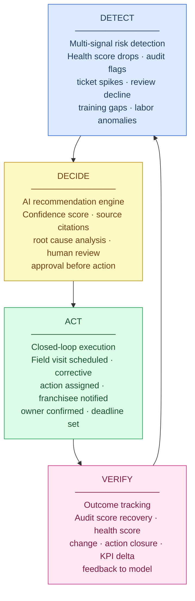

# DETECT -> DECIDE -> ACT -> VERIFY Loop

The core operating loop for AI-native franchise operational intelligence.

---

## Diagram

---

## Stage Definitions

### DETECT

**What it means:** Continuous aggregation of multi-source operational signals to identify patterns that indicate elevated location risk — before any individual signal has crossed a traditional alert threshold.

**What data inputs are used:**
- POS sales trend and labor cost percentage
- LMS training completion rates by employee and module
- Audit scores and corrective action closure rates
- Customer review platform ratings and sentiment trends
- Field visit frequency relative to standard cadence
- Support ticket volume and themes
- HR data: staff turnover, manager change events
- Pre-opening milestone completion (for locations in Year 1)

**What the AI produces:**
- Continuously updated Location Health Score (0-100) with 6 dimension scores
- Anomaly detection flags for statistically unusual multi-signal patterns
- Score trajectory indicator (Improving / Stable / Declining / Accelerating Decline)
- Score state classification: Healthy / Watchlist / At Risk / Critical
- Top 3 score driver explanation with source citations

**What the human does:**
Receives proactive notification when the health score crosses a state boundary or when an anomaly flag is generated. Does not need to initiate a report or dashboard review — the signal comes to them.

**What gets stored:**
- Time-stamped health score snapshots with dimension breakdowns
- Anomaly detection event logs
- Score state transition history per location
- Signal state records linking each score to its source data

**Franchise-specific example:** A QSR location in Atlanta has a health score of 79 (Healthy) for 6 months. Over 21 days, the AI detects: audit score drops from 88 to 74; training completion falls from 82% to 58%; Google review score dips from 4.2 to 3.8; opening checklist completion drops to 71%. No single threshold is breached. But the multi-signal pattern matches 34 historical locations — all of which declined further over the next 60 days without intervention. Health score moves to 63 (At Risk). DECIDE stage triggered.

---

### DECIDE

**What it means:** Transformation of a detected risk signal into a structured, explainable, human-reviewable recommendation. The AI does not take action. It generates a decision-support artifact with source citations, confidence scoring, comparable historical cases, and a specific recommended action — for human review and approval.

**What data inputs are used:**
- Current and historical health score and dimension scores
- Open corrective actions from prior visits (age, category, closure probability)
- Prior field visit history and outcomes at this location
- Training completion data by employee and certification status
- Peer location comparison data (where is this location relative to comparable locations?)
- Historical intervention outcomes at similar locations (outcome model)
- Franchisee relationship context (tenure, prior compliance record)

**What the AI produces:**
- Recommended action type (field visit / corrective action plan / training intervention / franchisee escalation)
- Priority classification (Urgent <48h / High <7 days / Moderate <14 days)
- Plain-language rationale with source citations for every claim
- Confidence score with uncertainty factors identified
- 3-5 comparable historical cases showing intervention outcomes
- Draft corrective action plan (pre-populated, for human review)

**What the human does:**
Reviews the recommendation. Can approve, modify, override (with reason captured), or delegate. No AI action is dispatched without this review.

**What gets stored:**
- Recommendation record with full rationale, source citations, and confidence
- Human decision record (approved / modified / overridden) with timestamp and notes
- Override capture records for model improvement

**Franchise-specific example:** AI generates a recommendation for the Atlanta location: "Schedule focused field visit within 7 days. Primary focus: food safety handling (3 repeat audit failures) and opening procedures (2 consecutive cycles below 80%). Confidence: 74%. Based on 34 comparable At Risk QSR locations, a focused visit with targeted food safety corrective actions produced an average 16-point health score recovery within 45 days." Field consultant reviews, adjusts the visit date by 2 days, approves.

---

### ACT

**What it means:** Conversion of an approved recommendation into structured, tracked actions with owners, deadlines, and accountability mechanisms. Closed-loop execution management — not just task creation, but outcome-linked tracking.

**What data inputs are used:**
- Approved recommendation from DECIDE stage
- Field consultant calendar and territory assignment
- Franchisee contact information and communication preferences
- LMS employee data (for named owner assignment in corrective action plans)
- Location operational context (hours, current staffing, recent changes)

**What the AI produces:**
- AI-generated pre-visit brief (30-second synthesis of health score, open items, focus areas, staff context)
- Structured corrective action plan with named owners and deadlines
- Draft franchisee communication for field consultant review
- Voice-to-structured note interface for in-visit observation capture
- Post-visit summary auto-generated from tagged observations

**What the human does:**
- Field consultant executes the visit using AI-generated brief as preparation
- Uses voice-to-structured notes to capture observations in real time
- Reviews and approves the corrective action plan with franchisee present
- Franchisee acknowledges action ownership in-app

**What gets stored:**
- Structured visit record with tagged observations, scores, and notes
- Final corrective action plan with owners, deadlines, and acknowledgment status
- Voice recording transcription and tagging
- AI-generated visit summary

**Franchise-specific example:** The field consultant visits the Atlanta location. Uses the AI pre-visit brief (food safety and opening procedures flagged as focus areas). Voice notes capture: "food safety holding temperature issue at the hot bar," "opening checklist not completed before first customer — third consecutive observation," "two employees not current on food handler certification." AI generates corrective action plan: food handler certification for Sarah M. and James T. (14-day deadline), opening procedure role-play for morning shift (21-day deadline). Franchisee acknowledges ownership of both actions.

---

### VERIFY

**What it means:** Systematic measurement of whether the actions taken in ACT produced the operational improvements predicted in DECIDE. Verification is what transforms the platform from a workflow tool into an outcome-linked system.

**What data inputs are used:**
- Corrective action closure status (owner-reported + audit-confirmed)
- Follow-up audit scores (triggered by corrective action closure or scheduled follow-up)
- Location Health Score trajectory post-intervention
- KPI data for the specific dimensions targeted in the corrective action plan
- Training completion records for employees named in corrective actions
- Customer review trend post-intervention

**What the AI produces:**
- Corrective action closure rate tracking with expiration alerts
- Health score trajectory analysis post-intervention (did the recovery occur as predicted?)
- Intervention effectiveness record for the outcome model
- Outcome summary for the field consultant and management team
- Model feedback signal (did the predicted outcome occur?)

**What the human does:**
- Reviews verification reports during portfolio management
- Confirms corrective action closure for items requiring physical verification
- Provides structured feedback when outcomes differ from predictions

**What gets stored:**
- Intervention outcome records: action type, location type, score state, outcome score change, time to recovery
- Corrective action closure records
- Model feedback signals
- Longitudinal location health trajectory records

**Franchise-specific example:** 45 days after the Atlanta visit: both corrective actions are closed (Sarah and James completed certification on Day 11; morning shift opening procedure refresher completed Day 19). Google review score recovered to 4.0. Follow-up audit score: 83 (from 74 at the pre-intervention low). Health score: 72 (Watchlist recovery from 63 At Risk). Platform records: "Effective intervention — focused visit with food safety and opening procedure corrective actions at QSR At Risk location produced 9-point audit score recovery and Watchlist recovery within 45 days." Outcome added to the model's training dataset. The loop closes.

---

## The Learning Layer: Outer Loop

Beyond the four operational stages, the Learning Layer closes an outer loop that makes the system continuously more intelligent.

Every verified outcome is a training data point. Every override is a model refinement signal. Every comparable case in the recommendation engine is enriched by new evidence.

After 10,000 verified interventions across 200 brands, the system knows with high confidence which intervention at which location type under which conditions produces which outcome — knowledge that no human team and no competitor without a closed-loop verification architecture can replicate.

This is the compounding advantage that makes AI-native franchise operational intelligence a winner-take-most market dynamic.
