# Franchise Operational Intelligence Stack

> The complete layered architecture of an AI-native franchise operational intelligence platform — from raw data through autonomous operations.

---

## Full Stack Diagram

```mermaid
flowchart TB
    subgraph L7["Layer 7 — Autonomous Operations"]
        direction LR
        A7["AI Agents\nField Consultant · Launch Coordinator\nCompliance · Financial Analyst\nExecutive Intelligence"]
        B7["Supervised Execution\nHuman oversight gates\nAudit-logged actions\nGraceful override"]
    end

    subgraph L6["Layer 6 — Learning Layer"]
        direction LR
        A6["Outcome-Linked Training\nVerified intervention records\nModel accuracy improvement"]
        B6["Cross-Brand Intelligence\nBest-practice detection\nVertical benchmarking"]
    end

    subgraph L5["Layer 5 — Verification Layer"]
        direction LR
        A5["Outcome Tracking\nHealth score trajectory post-action\nCorrective action closure verification"]
        B5["Intervention Effectiveness\nDid the action work?\nModel calibration feedback"]
    end

    subgraph L4["Layer 4 — Action Layer"]
        direction LR
        A4["Closed-Loop Execution\nTask creation · Assignment · Routing\nDeadline tracking · Escalation chains"]
        B4["Field Operations\nPre-visit brief · Voice notes\nCA plan generation · Visit summary"]
    end

    subgraph L3["Layer 3 — Decision Layer"]
        direction LR
        A3["Recommendation Engine\nAction type · Priority · Confidence\nSource citations · Comparable cases"]
        B3["Human Approval Gates\nReview · Modify · Override\nOverride capture · Audit log"]
    end

    subgraph L2["Layer 2 — Intelligence Layer"]
        direction LR
        A2["Location Health Score\n6-dimension composite · Score state\nExplainability · Peer benchmarking"]
        B2["Anomaly Detection\nMulti-signal pattern detection\nStatistical anomaly scoring"]
    end

    subgraph L1["Layer 1 — Unified Data Layer"]
        direction LR
        A1["Data Normalization\nFranchise-native data model\nCross-brand tagging · Entity resolution"]
        B1["Real-Time Pipeline\nAPI-first · Webhook events\nData quality monitoring · Freshness"]
    end

    subgraph L0["Layer 0 — Data Foundation"]
        direction LR
        A0["Internal Systems\nPOS · LMS · Audit · HRIS/Payroll\nCRM · Ticketing · Scheduling"]
        B0["External Signals\nReview platforms · Regulatory data\nLabor market data"]
    end

    L0 --> L1
    L1 --> L2
    L2 --> L3
    L3 --> L4
    L4 --> L5
    L5 --> L6
    L6 --> L2
    L6 --> L7
    L7 --> L4
```

---

## Layer Descriptions

### Layer 0: Data Foundation

The raw operational data layer. Includes all source systems that generate franchise operational signals — both internal systems under the franchisor's control and external signals from the market.

**Internal systems:** POS (Toast, PAR, Square, Oracle MICROS), LMS (FranConnect LMS, Trainual, TalentLMS), Audit platforms (FranConnect Compliance, Zenput), HRIS/Payroll (ADP, Paychex, Rippling), CRM (FranConnect CRM), Ticketing (Zendesk, Intercom), Scheduling (7shifts, Homebase)

**External signals:** Review platforms (Google Business Profile API, Yelp), Regulatory databases (state health inspection records where available), Labor market data (job posting volumes by geography)

**Strategic note:** Layer 0 does not belong to the platform — it belongs to best-of-breed operational systems. The platform's competitive moat comes from the depth and breadth of Layer 0 connectivity, not from owning Layer 0.

---

### Layer 1: Unified Data Layer

The data infrastructure layer that transforms raw signals from diverse, inconsistent source systems into a normalized, structured, franchise-native data model.

**Data normalization:** Standardized location identifiers across all integrated systems; cross-system entity resolution; data quality scoring; canonical taxonomy mapping for audit findings, training modules, and corrective action categories.

**Franchise-native data model:** Hierarchical organization (Brand > Region > District > Location > Unit); role-aware data access architecture; multi-brand normalization for brands operating multiple concepts.

**Real-time pipeline:** API-first integration with webhook support for real-time event streaming; batch sync for historical data; pipeline monitoring with data quality dashboards.

**Strategic note:** Layer 1 is the most technically complex layer and the most durable competitive moat once built. A platform with a deep, clean, franchise-native data model is extremely difficult to displace.

---

### Layer 2: Intelligence Layer

The AI reasoning layer that transforms normalized data into operational intelligence — health scores, anomaly flags, benchmarks, and risk stratifications.

**Location Health Score:** Weighted composite model aggregating signals across 6 operational dimensions; continuously updated; score states (Healthy / Watchlist / At Risk / Critical); explainability (top-3 driver with source citations); peer benchmarking.

**Anomaly Detection:** Statistical anomaly detection on individual signal streams; cross-signal pattern detection (combinations that historically precede performance decline); time-series decomposition for seasonality-adjusted detection.

**Benchmarking Engine:** Peer group construction; brand average benchmarks; top-quartile performance analysis; cross-brand benchmarks (unique competitive moat that requires platform scale).

---

### Layer 3: Decision Layer

The recommendation and governance layer that transforms intelligence outputs into actionable, human-reviewable, auditable decisions.

**Recommendation Engine:** Action type classification; priority scoring; confidence scoring; comparable case matching; source citation on every recommendation.

**Human Approval Gates:** Review/Modify/Override/Delegate workflow; override capture with structured reason; complete audit log of every recommendation and decision.

---

### Layer 4: Action Layer

The execution layer that converts approved recommendations into structured, tracked actions.

**Closed-Loop Execution:** Task creation with owner assignment; deadline management with escalation automation; multi-party coordination (FC + franchisee + HQ support).

**Field Operations:** AI pre-visit brief generation; voice-to-structured notes; corrective action plan auto-drafting; post-visit summary generation; franchisee acknowledgment workflow.

---

### Layer 5: Verification Layer

The outcome measurement layer that closes the loop by confirming whether actions produced the predicted improvements.

**Outcome Tracking:** Health score trajectory tracking post-intervention; corrective action closure verification; follow-up audit triggering and score comparison; KPI delta measurement for targeted dimensions.

**Intervention Effectiveness:** Structured outcome records comparing actual vs. predicted outcomes; model calibration feedback signals.

---

### Layer 6: Learning Layer

The continuous improvement layer that aggregates verified outcomes and uses them to improve model accuracy.

**Outcome-Linked Training:** Model retraining on verified intervention records; feedback integration from human overrides; prediction accuracy monitoring.

**Cross-Brand Intelligence:** Best-practice identification across all brands on the platform; emerging risk pattern detection that becomes visible across brands before it is well-understood within any single brand.

---

### Layer 7: Autonomous Operations Layer

The future-state layer where AI agents execute within defined guardrails with human oversight at key decision gates rather than at every step.

**AI Agents:** Field Consultant, Launch Coordinator, Compliance Agent, Financial Analyst, Executive Intelligence Agent — each operating within defined scope, risk level, and approval model.

**Supervised Execution:** All autonomous actions logged; human override capability maintained; graceful degradation when confidence is insufficient; high-risk actions always require explicit human authorization.
