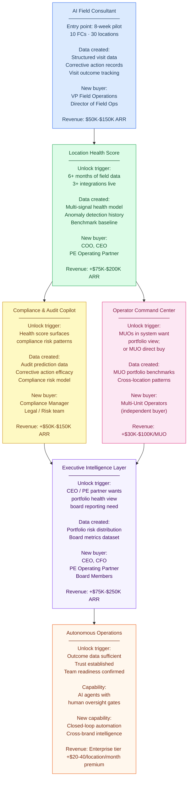

# Wedge Expansion Path: From AI Field Consultant to Autonomous Operations

---

## Expansion Path Diagram

---

## Stage-by-Stage Analysis

### Stage 1: AI Field Consultant

**What unlocks it:** The field consultant pain is visible and acute to VP of Operations and Directors of Field Operations. No special prerequisite — only requires an LMS integration and audit history access to power the pre-visit brief.

**What data it creates:** The most valuable data the platform can accumulate: structured visit observations (tagged, normalized), corrective action records (type, owner, deadline, closure outcome), and visit effectiveness data (health score and audit score change in the 30-60-90 days following each visit). This data is the training foundation for the Location Health Score model.

**What new buyer it opens:** VP Field Operations (direct champion and budget authority for the field consulting investment); Director of Field Operations (primary user and day-to-day champion); COO (executive sponsor who sees the ROI case).

**What new revenue it creates:** The AI Field Consultant module at Intelligence Tier pricing: $45-80/location/month across all locations in a brand. For a 200-location brand, this is $108,000-$192,000 in new ARR.

---

### Stage 2: Location Health Score

**What unlocks it:** After 6 months of AI Field Consultant deployment, the platform has 6 months of structured visit data, corrective action records, and multi-source integration data. This is sufficient to build a reliable health model. The COO who has been watching the field consultant data and seeing improvements will want a unified portfolio health view. This is the expansion trigger conversation.

**What data it creates:** The health model itself — a time-series of location health scores across 6 dimensions, anomaly detection history, benchmark comparisons. This becomes the training data for compliance risk prediction and the primary data source for executive intelligence.

**What new buyer it opens:** COO (the health score becomes their primary operational management tool), CEO (the Executive Command Center v1 is unlocked by the health score), PE Operating Partner (the portfolio health view creates the PE channel entry point).

**What new revenue it creates:** Intelligence Tier expansion for all locations in the brand. Existing customers moving from Operations Tier to Intelligence Tier: typically $20-45/location/month uplift. For a 200-location brand: $48,000-$108,000 in expansion ARR.

---

### Stage 3: Compliance and Audit Copilot

**What unlocks it:** The Location Health Score begins surfacing compliance risk patterns — locations with declining training completion and corrective action backlogs before their next scheduled audit. The Compliance Manager sees the opportunity to use this predictive data proactively. The expansion conversation is triggered by the compliance dimension of the health score showing patterns that suggest the compliance team is not acting on the signals the platform is surfacing.

**What data it creates:** Audit prediction data (which locations predicted as high-risk proved to fail, and why), corrective action efficacy data (which corrective action categories produced the most reliable audit score improvement), compliance intervention timing data (how early does an intervention need to occur to prevent an audit failure?).

**What new buyer it opens:** Compliance Manager (a new stakeholder with independent budget authority), Legal / Risk team (regulatory risk reduction is a budget-unlocking value proposition).

**What new revenue it creates:** Compliance module expansion at Intelligence Tier. For a 200-location brand: $15,000-$40,000 additional ARR from compliance module.

---

### Stage 4: Operator Command Center

**What unlocks it:** Multi-unit operators in the franchise system — who collectively own 40-60% of locations — see the field consulting and compliance tools in use at HQ and request a portfolio view for their own operations. Or, MUOs approach as direct buyers independently of HQ. The expansion trigger is either internal (MUO franchisee council request) or external (MUO direct sale).

**What data it creates:** MUO portfolio benchmark data (how MUO-managed portfolios perform vs. single-unit operators, brand average, and peer MUOs), cross-location performance patterns within MUO portfolios (labor cost efficiency, training consistency, audit score distribution).

**What new buyer it opens:** Multi-unit operators as direct buyers with independent budget authority. One MUO managing 20 locations is a $25,000-$50,000 ARR direct buyer. There are typically 10-40 significant MUOs in any mid-market franchise system.

**What new revenue it creates:** Direct MUO subscription revenue. For a franchise system with 20 MUOs of average 10 locations each: 20 MUO contracts at $3,000-$6,000/year per MUO = $60,000-$120,000 in new ARR from within the same franchise system.

---

### Stage 5: Executive Intelligence Layer

**What unlocks it:** The CEO or PE Operating Partner has seen the Location Health Score and health score trend data in the COO's portfolio management reviews. They want a version optimized for executive and board reporting. Or, the PE operating partner wants a cross-portfolio view across their franchise brand investments.

**What data it creates:** Portfolio risk distribution data (health score distribution across the full system over time), board-ready metrics dataset, PE operating partner cross-portfolio benchmark data.

**What new buyer it opens:** CEO, CFO (for financial intelligence and royalty anomaly features), PE Operating Partners (the highest-value expansion persona — one relationship = multi-portfolio expansion potential).

**What new revenue it creates:** Enterprise Tier upgrade for the brand. For a 200-location brand: additional $20-40/location/month premium for autonomous operations features + executive tier = $48,000-$96,000 additional ARR.

---

### Stage 6: Autonomous Operations

**What unlocks it:** 18-24 months of verified outcome data from field consulting and health score deployments; established trust architecture with 2+ years of production governance track record; operations team readiness for supervised AI agent workflows.

**What capability it creates:** AI agents that initiate and execute certain operational actions within defined guardrails — visit scheduling, corrective action routing, audit scheduling, executive brief generation — with human oversight gates rather than individual approvals for every action.

**What new revenue it creates:** Enterprise Tier premium pricing: additional $20-40/location/month over Intelligence Tier pricing for agent-enabled customers.
