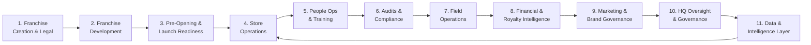

# Franchise Value Chain: 11-Stage Map

> A comprehensive mapping of the franchise operations lifecycle — from legal creation through AI-native intelligence — showing key workflows, owners, pain points, existing software, and AI opportunities at each stage.

---

## Value Chain Overview

---

## Stage 1: Franchise Creation and Legal

**Description:** The legal and structural foundation of the franchise system. Includes FDD creation, franchise agreement templates, territory definition, fee structures, and ongoing legal compliance.

| Dimension | Detail |
|---|---|
| Key Workflows | FDD drafting and annual updates; franchise agreement execution; territory mapping and protection; regulatory filings by state; IP and trademark management |
| Primary Owner | Chief Legal Officer, Outside Franchise Counsel, Franchise Development |
| Existing Software Category | Legal document management, DocuSign, FranConnect FDD management |

**Pain Points:**
1. FDD updates require manual coordination across legal, finance, and operations teams — typically 60-90 days annually.
2. State-level regulatory differences create compliance complexity that is difficult to track at scale.
3. Franchise agreement terms (territorial rights, renewal conditions, transfer provisions) are stored in static documents with no operational linkage — critical dates and obligations go unmissed.

**AI Opportunity:** Automated FDD change detection and impact analysis; contract obligation tracking with automated alerts; state regulatory compliance monitoring.

**Strategic Relevance:** Low as a wedge, but foundational for enterprise platform completeness. This is table stakes for large franchise brands but not where operational AI wins first.

---

## Stage 2: Franchise Development

**Description:** The pipeline that grows the franchise system. Includes lead generation, candidate qualification, discovery day, FDD delivery, franchisee selection, and agreement signing.

| Dimension | Detail |
|---|---|
| Key Workflows | Lead capture and qualification; candidate scoring; discovery day management; FDD delivery and acknowledgment; fee collection and agreement execution; new franchisee onboarding handoff |
| Primary Owner | VP of Franchise Development, Franchise Development Managers, Franchise Brokers |
| Existing Software Category | FranConnect CRM, Salesforce, HubSpot, Franchise Sales OS |

**Pain Points:**
1. Franchise candidate quality is inconsistent — development teams often lack objective scoring models that predict franchisee success based on operational readiness, capital adequacy, and market fit.
2. Pipeline visibility is poor — development leaders struggle to forecast signing timelines and opening dates, making revenue projection difficult.
3. Handoff from development to operations is fragmented — context about the new franchisee (financial situation, operational experience, risk factors) does not transfer cleanly.

**AI Opportunity:** Franchisee success prediction scoring based on candidate profile; AI-assisted discovery day follow-up; pipeline forecasting; automated handoff documentation.

**Strategic Relevance:** Important for FranConnect's existing CRM user base. Not the primary AI wedge, but AI scoring creates stickiness.

---

## Stage 3: Pre-Opening and Launch Readiness

**Description:** Everything that must happen between franchise agreement signing and opening day. Includes site selection, lease negotiation, construction management, equipment procurement, initial inventory, permitting, staffing, and pre-opening training.

| Dimension | Detail |
|---|---|
| Key Workflows | Site selection and approval; lease review; construction milestone tracking; equipment procurement and installation; health and safety inspections; pre-opening training completion; grand opening planning |
| Primary Owner | Pre-Opening Coordinator, Franchise Operations, New Franchisee |
| Existing Software Category | FranConnect Launch, ServiceBridge, custom project management tools |

**Pain Points:**
1. Pre-opening delays are common and expensive — average cost of a 30-day delay in a restaurant franchise is estimated at $15,000-$50,000 in lost revenue, yet delays are rarely detected early enough to course-correct.
2. Checklist compliance is manual and inconsistently tracked — field teams are not alerted when critical milestones are missed.
3. Franchisee training completion rates before opening day are below target in most systems, yet this is one of the strongest predictors of first-year performance.

**AI Opportunity:** Launch delay prediction based on milestone completion patterns; automated escalation when critical-path items fall behind; training completion risk scoring.

**Strategic Relevance:** High signal value for Location Health Score (pre-opening completion rate predicts Year 1 performance). Strong ROI story for reducing delayed openings.

---

## Stage 4: Store Operations

**Description:** The day-to-day execution of the franchise operating model. Includes opening and closing procedures, SOP adherence, task management, shift management, food safety, inventory, and customer experience delivery.

| Dimension | Detail |
|---|---|
| Key Workflows | Opening and closing checklists; daily task management; SOP documentation and distribution; shift scheduling; inventory management; food safety logs; incident reporting |
| Primary Owner | Store Manager, Franchisee, Area Manager |
| Existing Software Category | Jolt, Zenput, Crunchtime, 7shifts, Restaurant365 |

**Pain Points:**
1. SOP documentation is created centrally but adoption at the store level is inconsistent — managers interpret procedures differently and training gaps compound over time.
2. Task management is reactive — managers assign tasks in response to problems rather than proactively preventing them.
3. There is no mechanism for store managers to surface early signals of operational stress (staff morale issues, supply chain disruptions, equipment failures) before they become visible in performance metrics.

**AI Opportunity:** AI SOP assistant with natural language Q&A; predictive task prioritization based on historical patterns; anomaly detection in operational data streams.

**Strategic Relevance:** High daily active use; generates the richest operational signal data for Location Health Score.

---

## Stage 5: People Operations and Training

**Description:** The full HR and learning lifecycle for franchise employees — from hiring through ongoing certification, compliance training, and performance management.

| Dimension | Detail |
|---|---|
| Key Workflows | Job posting and applicant tracking; onboarding documentation; role-based training curriculum delivery; certification tracking; compliance training (food safety, harassment, labor law); performance reviews |
| Primary Owner | Director of Training, HR Manager, Store Manager |
| Existing Software Category | Trainual, TalentLMS, Cornerstone, FranConnect LMS, Homebase |

**Pain Points:**
1. Training completion rates drop sharply after initial onboarding — ongoing certification and refresher training completion is typically below 70% in most franchise systems.
2. Training effectiveness is unmeasured — there is no systematic link between training completion and operational performance, so it is impossible to know whether training investment is producing results.
3. High employee turnover (30-60% annually in QSR franchises) creates continuous onboarding burden, and new employee training-to-productivity timelines are too long.

**AI Opportunity:** AI-personalized training paths based on role, performance data, and identified skill gaps; training completion prediction and early intervention; outcome-linked training effectiveness measurement.

**Strategic Relevance:** Core module with strong retention value. Training data is a key signal for Location Health Score.

---

## Stage 6: Audits and Compliance

**Description:** The structured process for verifying that locations are executing the operating model correctly and meeting brand standards. Includes scheduled audits, surprise visits, corrective action management, and regulatory compliance.

| Dimension | Detail |
|---|---|
| Key Workflows | Audit schedule management; field audit execution (digital forms); scoring and reporting; corrective action plan creation; corrective action closure tracking; regulatory inspection management; brand standard updates |
| Primary Owner | Compliance Manager, Field Consultants, Area Managers |
| Existing Software Category | FranConnect Compliance, Zenput, FranchiseBlast, custom forms |

**Pain Points:**
1. Corrective action closure rates are chronically low — most franchise systems report 40-60% of corrective actions from audits are not formally closed, meaning identified problems are not verified as resolved.
2. Audit scheduling is static and risk-unaware — locations are audited on fixed schedules regardless of current risk profile, which means high-risk locations may go unvisited for months while low-risk locations receive equal attention.
3. Audit data and operational data are siloed — there is no automatic connection between an audit failure, a training gap, and a corrective action recommendation.

**AI Opportunity:** Risk-stratified audit scheduling; AI-generated corrective action plans; corrective action closure prediction and escalation; audit trend analysis and predictive failure detection.

**Strategic Relevance:** Critical wedge-adjacent module. Compliance is where PE-backed operators feel the most acute regulatory risk. Strong budget holder visibility.

---

## Stage 7: Field Operations

**Description:** The field consulting function — the human infrastructure that drives operational consistency through regular location visits, coaching, relationship management, and performance support.

| Dimension | Detail |
|---|---|
| Key Workflows | Visit planning and scheduling; pre-visit data review; location visit execution; structured observation and coaching; visit note capture; corrective action assignment; follow-up scheduling; portfolio management |
| Primary Owner | Field Consultants, District Managers, Area Development Managers |
| Existing Software Category | FranConnect Field Ops, custom CRM configurations, spreadsheets and email |

**Pain Points:**
1. Field consultants spend 30-40% of their time on administrative tasks (preparing visit plans, writing visit notes, updating tracking systems) rather than franchisee coaching and relationship work.
2. Visit quality is inconsistent and unmeasured — there is no standardized framework for what a high-quality field visit looks like, and there is no mechanism to track whether visit recommendations were implemented.
3. Field consultant portfolio management is reactive — visit priorities are driven by schedule rather than risk signal, meaning consultants may visit healthy locations at their scheduled frequency while struggling locations wait.

**AI Opportunity:** AI-powered visit prioritization based on health scores; pre-visit brief generation (audit history, performance trends, open corrective actions, staff changes); voice-to-structured note capture; auto-generated visit summaries and corrective action drafts; visit effectiveness measurement.

**Strategic Relevance:** This is the primary wedge. Highest pain, fastest ROI, richest data creation, most visible ROI to VP of Operations and CEO.

---

## Stage 8: Financial and Royalty Intelligence

**Description:** The financial management infrastructure of the franchise system. Includes royalty collection, POS sales reconciliation, financial reporting, labor cost management, and franchisee financial health monitoring.

| Dimension | Detail |
|---|---|
| Key Workflows | POS sales ingestion and reconciliation; royalty calculation and invoicing; royalty collection and aging; franchisee financial reporting; labor cost monitoring; P&L support; financial benchmarking |
| Primary Owner | CFO, Finance Team, Franchise Operations |
| Existing Software Category | FranConnect Royalty, Xero, QuickBooks, Restaurant365, custom BI tools |

**Pain Points:**
1. Royalty leakage from underreporting is a persistent problem — estimated at 3-8% of system revenue in systems without automated POS reconciliation.
2. Franchisee financial distress signals are typically only detected when royalties become delinquent — by that point, the franchisee is already in operational crisis.
3. Labor cost visibility is limited — most franchisors can see revenue data but not labor cost data, making AUV and EBITDA analysis incomplete.

**AI Opportunity:** Royalty anomaly detection; franchisee financial distress prediction; automated POS reconciliation with exception flagging; labor cost benchmarking.

**Strategic Relevance:** High value for PE-backed operators and CFOs. Expands platform from operations to financial intelligence.

---

## Stage 9: Marketing and Brand Governance

**Description:** The management of local marketing execution, brand compliance, co-op fund management, and campaign coordination across the franchise system.

| Dimension | Detail |
|---|---|
| Key Workflows | Local marketing plan review and approval; creative asset management and distribution; co-op fund management; national campaign localization; brand compliance auditing; social media monitoring; franchisee marketing training |
| Primary Owner | CMO, Marketing Manager, Franchisee |
| Existing Software Category | Brandfolder, Bynder, Lytho, Franchise Marketing tools, custom portals |

**Pain Points:**
1. Brand compliance across digital and physical touchpoints is difficult to monitor at scale — franchisees customize communications in ways that deviate from brand standards, often without realizing it.
2. Co-op fund allocation and reporting is manual and time-consuming — tracking contributions, approvals, and fund usage across hundreds of franchisees requires significant administrative overhead.
3. Local marketing effectiveness is not measured — there is no systematic connection between local marketing spend and location performance data.

**AI Opportunity:** AI brand compliance scanning (social, print, signage); automated co-op fund reporting; marketing performance attribution by location.

**Strategic Relevance:** Important for CMO persona. Less central to operational AI wedge but important for platform completeness.

---

## Stage 10: HQ Oversight and Governance

**Description:** Executive-level visibility into portfolio health, operational risk, financial performance, and strategic progress across the entire franchise system.

| Dimension | Detail |
|---|---|
| Key Workflows | Portfolio health dashboards; risk management reporting; operations committee reviews; board reporting; franchisee relationship management; system-wide initiative tracking |
| Primary Owner | CEO, COO, VP of Operations, PE Operating Partner |
| Existing Software Category | Custom BI tools, Tableau, Power BI, FranConnect reporting |

**Pain Points:**
1. Executive dashboards are backward-looking compilations of past-period data — they show what happened, not what is at risk today.
2. Portfolio-level risk assessment requires manual aggregation of data from multiple systems — no automated early warning signal reaches the executive team until a problem is already severe.
3. Board and LP reporting is time-intensive — preparing board-ready performance packages requires days of manual work from finance and operations teams.

**AI Opportunity:** AI-generated executive briefs; automated portfolio risk scoring; board-ready report generation; predictive portfolio health projections.

**Strategic Relevance:** This is the Executive Intelligence Layer — the final expansion module in the wedge path. High strategic value, high willingness to pay.

---

## Stage 11: Data and Intelligence Layer

**Description:** The horizontal technology infrastructure that connects all operational systems, normalizes data, enables cross-system analysis, and powers the AI intelligence layer.

| Dimension | Detail |
|---|---|
| Key Workflows | API integrations with POS, LMS, payroll, CRM, audit, review platforms; data normalization and tagging; cross-brand benchmarking; predictive model training; AI inference serving; integration monitoring |
| Primary Owner | CTO, Head of Product, Data Engineering |
| Existing Software Category | Snowflake, dbt, Fivetran, custom middleware, AI/ML platforms |

**Pain Points:**
1. Integration fragmentation means most franchise platforms have partial data — they see audit scores and training completions but not POS performance, labor data, or customer reviews, making unified health scoring impossible.
2. Data quality is poor in most franchise systems — inconsistent naming conventions, missing fields, and manual entry errors make AI model training unreliable.
3. Real-time data pipelines are expensive and complex to build — most franchise platforms are operating on nightly batch syncs, which defeats the purpose of proactive alerting.

**AI Opportunity:** This stage IS the AI opportunity — the intelligence layer sits here, aggregating all upstream signals to power health scoring, anomaly detection, benchmarking, and recommendation engines.

**Strategic Relevance:** This is the foundation of the AI-native competitive moat. Integration depth is a prerequisite for AI quality. Cross-brand benchmarking data compounds over time.
