# Wedge Strategy: AI Field Consultant as the Platform Entry Point

---

## Why Field Consulting Is the Human Heart of Franchise Operations

Field consultants are the most important operational resource in any franchise system. They are the living bridge between brand standards and local execution. When a franchise brand has 200 locations across 35 states, field consultants are the people who build relationships with franchisees, coach store managers, identify operational problems, drive corrective actions, and maintain the brand consistency that the franchise promise depends on.

A typical field consultant manages 30-50 locations and visits each one 4-12 times per year. That visit is not just an audit — it is a coaching session, a problem-solving session, a relationship maintenance event, and an early warning system for operational issues. The quality of field consulting has a direct and measurable relationship to location performance.

Yet field consultants are systematically under-tooled. They prepare visit plans in spreadsheets or from memory. They capture notes in email or Word documents. They track corrective actions in shared Google Sheets. They have no AI assistance in prioritizing their visit schedule, preparing for specific locations, capturing their observations, or measuring whether their visits produced measurable improvements.

This is a $4-8M annual operational asset in most mid-market franchise systems that is operating at 60% of its potential because of inadequate tooling.

---

## Why Field Consulting Is the Right Wedge

The wedge into a platform sale must have four properties: it must solve a specific, high-pain problem; it must produce measurable ROI in a short time frame; it must be narrow enough to close quickly without enterprise complexity; and it must create data exhaust that powers expansion.

Field consulting hits all four.

**High pain, high visibility.** VP of Operations and Director of Field Operations feel this problem acutely. They know their consultants are spending too much time on admin. They know visit quality is inconsistent. They know they cannot measure whether visits produce outcomes. This is a C-level-visible problem with a quantifiable cost.

**Fast, measurable ROI.** An 8-week pilot with 10 field consultants produces specific, quantifiable outcomes: hours of administrative time recaptured per consultant per week (typically 8-12 hours in early deployments), improvement in corrective action closure rates (typically 20-30 percentage points), reduction in time-to-visit-summary submission (typically from 24-48 hours to under 2 hours). These are numbers a VP of Operations can take to the CFO.

**Sharp enough to close quickly.** The AI Field Consultant is a focused, well-defined module — not a platform replacement. A buyer can approve a $15,000-$25,000 pilot without going through enterprise procurement. The pilot converts to a full contract if ROI targets are met.

**Creates the data exhaust for everything else.** Every AI-assisted field visit generates structured, tagged operational data that feeds the Location Health Score. Every corrective action created and tracked creates outcome data that feeds the Compliance Copilot. Every visit outcome recorded creates the training data for the recommendation engine. The wedge does not just solve the field consulting problem — it builds the foundation for the full intelligence platform.

---

## Expansion Path with Triggers

```mermaid
flowchart TD
    A["AI Field Consultant\n──────────────\nPrimary wedge\n10 FCs · 30 locations\n8-week pilot\n\nData created: visit data,\ncorrective action data,\nvisit outcomes"] --> B["Location Health Score\n──────────────\nTrigger: 6 months of\nvisit + corrective action\ndata; COO wants unified\nlocation view\n\nNew buyer: COO, CEO\nData created: health model,\nbenchmark baseline"]

    B --> C["Compliance & Audit Copilot\n──────────────\nTrigger: Health score surfaces\ncompliance risk patterns;\nCompliance Manager sees value\n\nNew buyer: Compliance Mgr, Legal\nData created: audit predictions,\ncorrective action efficacy"]

    C --> D["Operator Command Center\n──────────────\nTrigger: MUOs in the system\nwant portfolio view;\nor MUO buys independently\n\nNew buyer: Multi-Unit Operators\nData created: MUO portfolio\nbenchmarks, cross-location patterns"]

    D --> E["Executive Intelligence Layer\n──────────────\nTrigger: CEO or PE partner\nwants portfolio health view;\nboard reporting needed\n\nNew buyer: CEO, PE Partner\nData created: portfolio risk\ndistribution, executive brief data"]

    E --> F["Autonomous Operations\n──────────────\nTrigger: Trust established;\noutcome data sufficient;\noperations team ready\n\nNew capability: AI agents\nData created: autonomous\naction outcomes"]

    style A fill:#dbeafe,stroke:#2563eb
    style B fill:#dcfce7,stroke:#16a34a
    style C fill:#fef9c3,stroke:#ca8a04
    style D fill:#fce7f3,stroke:#db2777
    style E fill:#f5f3ff,stroke:#7c3aed
    style F fill:#fff7ed,stroke:#ea580c
```

### Stage 1: AI Field Consultant
**Entry trigger:** VP of Operations or Director of Field Operations has a quantifiable field consulting problem — admin burden, inconsistent visit quality, poor corrective action closure rates.
**New data created:** Structured visit data (tagged observations, focus areas, outcomes), corrective action data (type, owner, closure outcome), visit cadence and distribution data.
**New buyer unlocked:** No new buyer at this stage — sells to existing VP Operations relationship.
**Revenue potential:** $50,000-$150,000 ARR for the pilot and initial full deployment.

### Stage 2: Location Health Score
**Expansion trigger:** After 6 months of AI Field Consultant deployment, the platform has enough structured visit and corrective action data to build a reliable location health model. COO or CEO is now engaged and wants a unified portfolio health view.
**New data created:** Multi-signal health model baseline, benchmark dataset for the brand's location portfolio, anomaly detection history.
**New buyer unlocked:** COO, CEO, VP Finance — these leaders are not the field consulting buyers but become engaged when the health score is the executive reporting tool.
**Revenue potential:** +$75,000-$200,000 ARR expansion per brand.

### Stage 3: Compliance and Audit Copilot
**Expansion trigger:** Location Health Score begins surfacing compliance risk patterns that are not yet appearing in scheduled audit data. Compliance Manager or VP Operations sees the opportunity to use predictive risk data to make audit scheduling and corrective action generation more efficient.
**New data created:** Audit prediction data (which locations predicted as high-risk proved to be, and why), corrective action efficacy data (which corrective action categories produced the most reliable improvement).
**New buyer unlocked:** Compliance Manager, Legal/Risk team — a new stakeholder group with independent budget and strong ROI motivation.
**Revenue potential:** +$50,000-$150,000 ARR expansion.

### Stage 4: Operator Command Center
**Expansion trigger:** Multi-unit operators in the franchise system — who represent 40-60% of locations — see field consultant and compliance tools in use at HQ and request access to a portfolio view for their own operations. Or MUOs approach independently as buyers.
**New data created:** MUO portfolio benchmarks, cross-location performance patterns within MUO portfolios, MUO-level health score aggregation.
**New buyer unlocked:** Multi-unit operators — a direct buyer persona with independent purchasing authority.
**Revenue potential:** +$30,000-$100,000 per MUO (depending on portfolio size).

### Stage 5: Executive Intelligence Layer
**Expansion trigger:** CEO or PE operating partner has seen the Location Health Score and field consultant data and wants a portfolio-level intelligence view suitable for board reporting and investor presentations.
**New data created:** Portfolio risk distribution, executive brief data, board-ready metrics package.
**New buyer unlocked:** CEO, CFO, PE Operating Partners, Board Members.
**Revenue potential:** +$75,000-$250,000 ARR expansion for the executive tier.

---

## MVP Scope: AI Field Consultant

The MVP for the AI Field Consultant module should be narrow enough to close a pilot in 8-12 weeks, but deep enough to produce measurable ROI and generate the data that powers expansion.

**Core MVP features:**

1. **AI-generated pre-visit brief.** Synthesizes health score, open corrective actions, recent training completion data, customer review signals, and recommended visit focus areas. Output: a 1-page brief generated in under 30 seconds. Requires: LMS integration, audit history access, basic health indicator data (even if full health score is not yet available).

2. **Voice-to-structured notes.** Real-time transcription with automatic tagging of observations into predefined categories (food safety, opening procedures, customer service, training, etc.). Output: structured, searchable visit notes with tags and timestamps. Requires: mobile app with audio capture.

3. **AI-drafted corrective action plan.** From the structured observations captured during the visit, AI auto-drafts a corrective action plan with category-specific action items, suggested owners, and timelines. The field consultant reviews and approves before it is sent to the franchisee.

4. **Post-visit summary generation.** Auto-generates a structured visit summary from tagged observations and corrective action plan. Field consultant reviews and sends to franchisee in under 5 minutes.

5. **Visit effectiveness tracking.** Tracks which corrective actions from each visit are closed, whether audit scores improved in the 60 days following the visit, and whether the location's health indicators improved. Reports visit effectiveness back to the field consultant and their manager.

---

## Pilot Design: 8-Week AI Field Consultant Pilot

**Structure:**
- 10 field consultants from the same franchise brand
- 30 assigned locations (3 per consultant)
- Mix of location health states (10 Healthy, 12 Watchlist, 8 At Risk)

**Timeline:**
- Week 1-2: Onboarding; integration setup (LMS, POS basic, audit history); baseline metric capture for all 30 locations
- Week 3-6: Live AI-assisted visits; pre-visit briefs in use for every visit; voice-to-structured notes in use for all observation capture; corrective action plans AI-drafted and reviewed
- Week 7-8: Data analysis; ROI calculation; case study interview and documentation

**Baseline metrics to capture (Week 1):**
- Hours spent by FC on visit preparation per week
- Hours spent by FC on visit note writing per visit
- Corrective action closure rate for last 90 days at pilot locations
- Average time from visit end to visit summary submission
- Average audit score at pilot locations

**Measurement at Week 8:**
- Hours of administrative time recaptured per FC per week
- Corrective action closure rate change at pilot locations
- Time-to-visit-summary-submission improvement
- Field consultant NPS for pre-visit briefs (survey all 10 FCs)
- Franchisee satisfaction with visit quality (survey franchisees at 10 pilot locations)

---

## Success Metrics for the Pilot

| Metric | Target |
|---|---|
| Admin time recaptured per FC per week | 8+ hours |
| Corrective action closure rate improvement | +20 percentage points vs. baseline |
| Time-to-visit-summary improvement | 70%+ reduction (e.g., 24 hours to 2-3 hours) |
| FC NPS for pre-visit briefs | 70+ |
| Pilot-to-contract conversion | 100% of pilots meeting targets convert |

---

## Risks and Mitigations

| Risk | Mitigation |
|---|---|
| Field consultants resist changing their visit workflow | Change management investment: involve 2-3 FC champions in pilot design; frame as tool to enhance their expertise, not replace it; show how it reduces admin burden first |
| Integration setup takes longer than expected, delaying pilot data quality | Pre-integration assessment before pilot close; require minimum integration stack (LMS + audit history) as pilot prerequisite; set expectations about Week 1-2 as setup phase |
| AI pre-visit briefs are incorrect or miss important context that FCs know from relationships | Frame AI brief as a starting point for FC review, not a replacement for their knowledge; capture FC feedback on brief quality in structured format; use feedback to improve brief generation |
