# Franchise Operational Intelligence Stack

> A layered architecture diagram and description of the full franchise operational intelligence platform — from raw data through autonomous operations.

---

## Stack Diagram

```mermaid
flowchart TB
    subgraph L7["Layer 7: Autonomous Operations Layer"]
        direction LR
        A7a["AI Agents\nLaunch Coordinator · Compliance Agent\nField Coach · Financial Analyst"]
        A7b["Autonomous Execution\nSelf-initiating actions · Outcome-verified\nHuman oversight gates"]
    end

    subgraph L6["Layer 6: Learning Layer"]
        direction LR
        A6a["Cross-Brand Intelligence\nOutcome-linked model training\nBest-practice identification"]
        A6b["Continuous Improvement\nPrediction accuracy improvement\nIntervention library enrichment"]
    end

    subgraph L5["Layer 5: Verification Layer"]
        direction LR
        A5a["Outcome Tracking\nHealth score trajectory post-intervention\nCorrective action closure verification"]
        A5b["Intervention Effectiveness\nDid it work? Why or why not?\nModel feedback signals"]
    end

    subgraph L4["Layer 4: Action Layer"]
        direction LR
        A4a["Closed-Loop Execution\nTask creation · Assignment · Routing\nDeadline tracking · Escalation"]
        A4b["Field Visit Management\nPre-visit brief · Voice notes\nVisit summary · CA plan generation"]
    end

    subgraph L3["Layer 3: Decision Layer"]
        direction LR
        A3a["Recommendation Engine\nConfidence scoring · Source citations\nComparable cases · Priority routing"]
        A3b["Human Approval Gate\nReview · Modify · Override · Delegate\nAudit log of all decisions"]
    end

    subgraph L2["Layer 2: Intelligence Layer"]
        direction LR
        A2a["Location Health Score\nWeighted composite model\n6 dimension scores · Score state"]
        A2b["Anomaly Detection\nStatistical pattern detection\nBenchmarking · Peer comparison"]
    end

    subgraph L1["Layer 1: Unified Data Layer"]
        direction LR
        A1a["Data Normalization\nFranchise-native data model\nCross-brand tagging · Contextualization"]
        A1b["Real-time Pipeline\nAPI integrations · Webhook events\nBatch sync · Data quality monitoring"]
    end

    subgraph L0["Layer 0: Data Foundation"]
        direction LR
        A0a["Operational Systems\nPOS · LMS · Audit · HR/HRIS\nPayroll · CRM · Ticketing"]
        A0b["External Signals\nReview platforms · Labor market data\nSupply chain · Regulatory databases"]
    end

    L0 --> L1
    L1 --> L2
    L2 --> L3
    L3 --> L4
    L4 --> L5
    L5 --> L6
    L6 --> L2
    L6 --> L7
    L7 --> L4
```

---

## Layer 0: Data Foundation

### Purpose

Layer 0 is the raw signal layer — the operational and external data systems that generate the inputs for the intelligence platform. This layer does not belong to the franchise operations platform. It belongs to best-of-breed operational systems: POS vendors, LMS providers, HRIS platforms, payroll systems, and external data sources.

### Components

**Internal Operational Systems:**
- Point-of-sale (POS) systems: Toast, Square, PAR, Revel, Aloha — sales data, transaction counts, average ticket, labor cost
- Learning Management Systems (LMS): Trainual, TalentLMS, FranConnect LMS — training completion, certification status, quiz scores, time-on-task
- Audit platforms: FranConnect Compliance, Zenput, custom audit tools — audit scores, item-level failure data, corrective action history
- HRIS and payroll: ADP, Paychex, Rippling — employee data, turnover, wage data, hours worked
- CRM: FranConnect CRM, Salesforce — franchisee relationship data, development pipeline, communication history
- Ticketing and support: Zendesk, Intercom, email — support request volume, resolution times, escalation patterns

**External Signals:**
- Review platforms: Google Business Profile, Yelp, TripAdvisor — ratings, review volume, sentiment data
- Labor market data: Indeed job posting volume in market, local labor market tightness
- Regulatory databases: Health inspection records, ABC violations, labor law compliance notices
- Supply chain signals: Vendor delivery fulfillment rates, inventory shortage patterns

### Strategic Importance

The breadth and depth of Layer 0 connectivity directly determines the quality of AI outputs in every layer above. A platform with 3 integration sources can build a basic health model. A platform with 8-10 deeply integrated sources can build a predictive health model with substantially higher signal quality. Integration depth is the prerequisite for AI quality.

---

## Layer 1: Unified Data Layer

### Purpose

Layer 1 transforms raw signals from diverse, inconsistent source systems into a normalized, structured, franchise-native data model. This layer does the critical work of making data from different systems comparable, addressable, and usable for AI modeling.

### Components

**Data Normalization:**
- Standardized location identifiers across all integrated systems
- Normalized time series formats for trend analysis
- Cross-system entity resolution (matching employee records across LMS, HRIS, and payroll)
- Data quality scoring and exception handling

**Franchise-Native Data Model:**
- Hierarchical organization: Brand > Region > District > Location > Unit
- Role-aware data access: franchisee sees their locations; field consultant sees their territory; district manager sees their district; HQ sees the portfolio
- Multi-brand normalization for brands operating multiple concepts

**Real-time Pipeline:**
- API-first integration with webhook support for real-time event streaming
- Batch sync for systems without API support
- Change data capture for database-level integration
- Pipeline monitoring with data quality dashboards and anomaly detection in the data pipeline itself

### Strategic Importance

Layer 1 is the most technically complex layer to build and the most durable competitive moat once built. A platform with a deep, clean, franchise-native data model is extremely difficult to displace because migration would require rebuilding years of normalized historical data in a new system.

---

## Layer 2: Intelligence Layer

### Purpose

Layer 2 transforms normalized data signals into operational intelligence: health scores, anomaly flags, benchmarks, and risk stratifications. This is where the platform begins to know things that no individual system could surface.

### Components

**Location Health Score:**
- Weighted composite model aggregating signals across 6 operational dimensions (operations, training, compliance, financial, customer experience, field engagement)
- Continuous update cycle (score refreshed as new signals arrive, not just on batch schedule)
- Score states: Healthy (80-100), Watchlist (65-79), At Risk (50-64), Critical (below 50)
- Explainability: top 3 score drivers, source data citation, confidence indicator

**Anomaly Detection:**
- Statistical anomaly detection on individual signal streams (Z-score, isolation forest, LSTM-based sequence anomaly)
- Cross-signal pattern detection (combinations of signals that historically precede performance decline)
- Time-series decomposition for seasonality-adjusted anomaly detection (e.g., distinguishing a January sales dip from a true anomaly in a business with seasonal patterns)

**Benchmarking Engine:**
- Peer group construction (locations matched by brand, vertical, geography, location age, format type)
- Brand average benchmarks updated monthly
- Top-quartile performance benchmarks with driver analysis
- Cross-brand benchmarks for platforms serving multiple brands in the same vertical

---

## Layer 3: Decision Layer

### Purpose

Layer 3 transforms intelligence outputs into actionable, human-reviewable recommendations. This layer is the interface between AI reasoning and human judgment.

### Components

**Recommendation Engine:**
- Action type classification: field visit, remote coaching, corrective action plan, training intervention, franchise escalation, financial review
- Priority scoring: Urgent (<48 hours), High (<7 days), Moderate (<14 days), Informational
- Confidence scoring: percentage confidence in the recommendation with uncertainty explanation
- Comparable case matching: the 3-5 most similar historical interventions from the system and their outcomes
- Source citation: which specific data points from which specific systems drove the recommendation

**Human Approval Gate:**
- Review interface for field consultants, district managers, and operations leaders
- Approve / Modify / Override / Delegate workflow
- Override capture: structured note required for overrides, capturing the reason
- Delegation routing with notification
- Audit log of every recommendation, review, and decision

---

## Layer 4: Action Layer

### Purpose

Layer 4 converts approved recommendations into structured, tracked actions with owners, deadlines, and accountability mechanisms.

### Components

**Closed-Loop Execution:**
- Task creation from recommendation approval with auto-populated fields
- Owner assignment with role-based routing
- Deadline management with configurable escalation chains
- Multi-party coordination (field consultant + franchisee + HQ support)

**Field Visit Management:**
- AI-generated pre-visit brief (30-second synthesis of location health, open items, recommended focus areas)
- Visit execution with structured observation capture
- Voice-to-structured notes: real-time transcription with auto-tagging of observation categories
- Auto-generated visit summary and corrective action plan draft
- Franchisee acknowledgment workflow

---

## Layer 5: Verification Layer

### Purpose

Layer 5 closes the loop by measuring whether the actions taken in Layer 4 actually produced the outcomes predicted in Layer 3.

### Components

**Outcome Tracking:**
- Health score trajectory tracking post-intervention (daily snapshot comparison)
- Corrective action closure tracking with verification requirements
- Follow-up audit triggering and score comparison
- KPI delta measurement for dimensions targeted in the intervention

**Intervention Effectiveness Records:**
- Structured outcome record: intervention type, location characteristics, pre-intervention score state, post-intervention score state, time to recovery, verified / unverified
- Comparison of actual outcomes to predicted outcomes (model calibration data)
- Attribution analysis: which specific corrective action items drove which dimension score changes

---

## Layer 6: Learning Layer

### Purpose

Layer 6 aggregates verified outcome data across the entire platform and uses it to continuously improve model accuracy, recommendation quality, and intervention efficacy predictions.

### Components

**Cross-Brand Intelligence:**
- Outcome model training on verified intervention records across all brands
- Best-practice identification: which location types with which risk patterns benefit from which intervention types
- Emerging risk pattern detection: new signal combinations that correlate with risk across the platform before they are well-understood

**Continuous Model Improvement:**
- Prediction accuracy monitoring (how often does the model's predicted outcome match the verified outcome?)
- Feedback integration from human overrides (why did humans override recommendations, and were they right?)
- Intervention library enrichment: as new intervention types are executed and verified, they are added to the recommendation engine's action set

---

## Layer 7: Autonomous Operations Layer

### Purpose

Layer 7 is the future state — AI agents that execute within the DETECT -> DECIDE -> ACT -> VERIFY loop with human oversight at defined decision gates rather than at every step. This layer is appropriate for Stage 5 maturity and should be built incrementally as trust, data quality, and governance frameworks mature.

### Components

**AI Agents:** (see `ai-native-strategy/ai-agents.md` for full agent documentation)
- AI Field Consultant: pre-visit brief generation, note capture, corrective action drafting
- AI Launch Coordinator: pre-opening milestone monitoring and escalation
- AI Compliance Agent: risk-stratified audit scheduling and auto-corrective action plan generation
- AI Executive Intelligence Agent: portfolio health brief generation and risk digest

**Autonomous Execution Principles:**
- All autonomous actions require a defined human oversight gate appropriate to action risk level
- Low-risk automations (reminder sending, report generation, data aggregation) can run without individual approval
- Medium-risk automations (corrective action creation, visit scheduling) require supervisory review
- High-risk automations (franchise agreement escalation, financial dispute flagging) always require explicit human authorization
