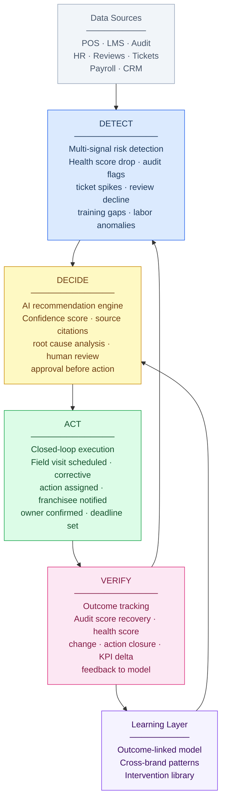

# Signal to Verified Action: The DETECT -> DECIDE -> ACT -> VERIFY Loop

> The core operating architecture for AI-native franchise operational intelligence.

---

## Overview

The DETECT -> DECIDE -> ACT -> VERIFY loop is not a process improvement. It is the fundamental architecture that separates operational intelligence from operational reporting. Every traditional franchise software platform produces reports. The AI-native platform produces verified outcomes by closing the loop from signal detection through action execution and outcome verification.

The loop runs continuously across every location in the portfolio. It does not require a human to initiate a report, pull a dashboard, or schedule a review. It surfaces risk, generates recommendations, routes actions, and verifies outcomes — operating as a continuous operational intelligence layer across the entire franchise system.

---

## The Loop Diagram

---

## Stage 1: DETECT

### What It Means

DETECT is the continuous process of aggregating multi-source operational signals and identifying patterns that indicate elevated risk at a specific location, before that risk is visible in lagging performance KPIs.

DETECT is fundamentally different from threshold alerting. A threshold alert fires when a metric crosses a pre-set boundary — for example, when an audit score drops below 70. DETECT identifies combinations of signals that historically precede performance decline, even when no individual signal has crossed a threshold.

### Data Inputs

| Signal Category | Specific Signals |
|---|---|
| Audit and compliance | Audit score trajectory, specific item failure patterns, corrective action closure rate, days since last audit |
| Training and HR | Training completion rate, certification lapses, staff turnover rate, new hire ratio, days since last training refresh |
| POS and financial | Sales vs. prior year, sales vs. peer average, average ticket size trend, transaction count trend, labor cost percentage |
| Customer experience | Review platform scores (Google, Yelp, brand-specific), review volume, sentiment keyword frequency, complaint ticket volume |
| Operational execution | Opening checklist completion rate, task completion rate by category, SOP acknowledgment currency |
| Field engagement | Days since last field visit, visit frequency vs. standard, open corrective actions from last visit, corrective action age |
| Equipment and maintenance | Open maintenance tickets, equipment downtime incidents, food safety equipment logs |
| Behavioral signals | Franchisee portal login frequency, support desk ticket patterns, communication response rate |

### What the AI Produces

- A continuously updated Location Health Score (0-100) with dimension scores across 6 operational categories
- Anomaly detection flags for statistically unusual patterns (not just threshold breaches)
- A risk trajectory indicator: improving, stable, declining, or accelerating decline
- A signal summary explaining the top 3 factors driving the current score state

### What the Human Does

In DETECT, humans receive proactive notifications when the health score crosses a state boundary (Healthy -> Watchlist, Watchlist -> At Risk, At Risk -> Critical) or when an anomaly flag is generated. The human does not need to pull a report — the signal comes to them.

### What Gets Stored

- Time-stamped health score snapshots with dimension breakdowns
- Signal state records (which signals contributed to which score at which time)
- Anomaly detection event logs
- Score state transition history per location

### Franchise-Specific Example

A location in Atlanta that has been Healthy (score: 79) for 6 months begins showing a pattern: audit score drops from 88 to 74 over two consecutive cycles; training completion rate falls from 82% to 58%; Google review score dips from 4.2 to 3.8 over 30 days; opening checklist completion drops to 71%. No single signal triggers a threshold alert, but the AI health model detects a pattern it has seen at 34 other locations — all of which continued declining for 60-90 days before intervention. The health score drops to 63 (At Risk). A DECIDE recommendation is generated automatically.

---

## Stage 2: DECIDE

### What It Means

DECIDE transforms a detected risk signal into a structured, human-reviewable recommendation. The AI does not take action. It generates a recommendation — including the rationale, the confidence level, the source data, and the specific action recommended — and presents it for human review and approval.

DECIDE is where trust architecture matters most. A recommendation that arrives without explanation is an alert. A recommendation that arrives with source citations, confidence scoring, comparable cases from the system, and a clear rationale for the recommended intervention is a decision-support tool that earns operational trust.

### Data Inputs

- Current and historical health score and dimension scores
- Open corrective actions and their ages
- Field consultant visit history and outcomes at this location
- Training completion data by employee and module
- Peer location comparison data
- Historical intervention outcomes at similar locations
- Franchisee relationship context (tenure, prior compliance record, communication patterns)

### What the AI Produces

A structured recommendation object containing:
- **Recommended action type:** Field visit, remote coaching session, corrective action plan, training intervention, franchisee escalation
- **Priority:** Urgent (within 48 hours), High (within 7 days), Moderate (within 14 days)
- **Rationale:** The specific signal pattern that triggered the recommendation, in plain language
- **Source citations:** The specific data points from specific systems that drove the recommendation
- **Confidence score:** The AI's confidence in the recommendation, expressed as a percentage with an explanation of uncertainty factors
- **Supporting evidence:** The 3-5 comparable cases from the system where a similar intervention produced a specific outcome
- **Recommended focus areas:** The specific operational categories the field visit or intervention should address
- **Draft corrective action plan:** A pre-populated corrective action plan based on the finding categories

### What the Human Does

The field consultant, district manager, or operations leader reviews the recommendation. They can:
- Approve and execute as recommended
- Modify (change priority, adjust the corrective action plan, add context)
- Override with a note explaining why
- Delegate to another team member

All decisions — including overrides — are logged for model feedback and audit purposes.

### What Gets Stored

- Recommendation records with full rationale, source citations, and confidence scores
- Human decision records (approved / modified / overridden) with timestamps and notes
- Override capture records (what the human changed and why)
- Delegation records

### Franchise-Specific Example

Continuing the Atlanta example: the AI generates a recommendation: "Schedule a focused field visit within 7 days for this location. Primary focus: food safety handling procedures (3 repeat audit failures) and opening procedures (2 consecutive cycles below 80%). Recommended corrective action targets: food handler certification refresh for 4 employees (Sarah M., James T., David K., and 1 untrained new hire), and opening procedure role-play for morning shift. Confidence: 74%. Based on 23 comparable At Risk locations in the system where a similar focused visit with targeted training corrective actions produced an average 16-point health score recovery within 45 days." The field consultant reviews, adjusts the visit date by one day due to schedule constraints, and approves.

---

## Stage 3: ACT

### What It Means

ACT is the execution layer — where approved recommendations are converted into structured actions with owners, deadlines, and accountability mechanisms. ACT is not just task creation. It is closed-loop execution management: the platform tracks every assigned action, sends reminders, escalates overdue items, and creates a documented record of what was done.

### Data Inputs

- Approved recommendation object from DECIDE stage
- Field consultant calendar and portfolio assignment
- Franchisee contact information and communication preferences
- Location operational context (operating hours, current staffing, recent changes)
- Open corrective action backlog for this location

### What the AI Produces

- Structured field visit record (visit type, scheduled date, focus areas, pre-visit brief)
- AI-generated pre-visit brief for the field consultant (health score summary, dimension breakdown, open corrective actions, key staff information, recent changes, recommended talking points)
- Structured corrective action plan with individual action items, owners (specific employee names where available), deadlines, and verification requirements
- Draft franchisee communication with visit purpose, corrective action summary, and owner acknowledgment request
- Voice-to-structured note template for the field visit

### What the Human Does

During the field visit, the consultant:
- Executes the visit with AI-generated focus areas as a structured guide
- Uses voice-to-structured notes to capture observations in real time (audio is transcribed and auto-tagged)
- Reviews and finalizes the corrective action plan with the franchisee during the visit
- Obtains franchisee acknowledgment of corrective action ownership and deadlines

### What Gets Stored

- Structured visit record with tagged observations, scores, and notes
- Final corrective action plan with owners, deadlines, and acknowledgment status
- Voice recording transcription and tagging
- Visit summary (auto-generated by AI from structured notes)
- Franchisee communication log

### Franchise-Specific Example

The field consultant visits the Atlanta location. Using the AI pre-visit brief, the visit is focused on food safety and opening procedures. The consultant uses voice-to-structured notes: observations are tagged in real time as "food safety: holding temperature issue," "opening procedure: checklist not completed before first customer," and "training gap: two employees not certified." The AI generates a visit summary and corrective action plan in 3 minutes. The franchisee signs off on 4 specific actions with 14-day and 30-day deadlines. All actions are created in the platform with named owners.

---

## Stage 4: VERIFY

### What It Means

VERIFY is where the loop closes — and where most current franchise software platforms stop providing value. Verification is the systematic tracking of whether the actions taken in the ACT stage actually produced measurable improvement in the underlying operational signals that triggered the DETECT stage.

Verification is what transforms the platform from a workflow tool into an outcome-linked system. Without verification, the platform can say "we generated 1,000 corrective actions last quarter." With verification, the platform can say "of the 1,000 corrective actions generated last quarter, 78% were closed on time, 82% were followed by measurable improvement in the targeted operational dimension, and the average health score recovery for At Risk locations that received a focused visit was 14 points within 45 days."

### Data Inputs

- Corrective action completion status (owner-reported + audit-confirmed)
- Follow-up audit scores (scheduled or triggered by corrective action closure)
- Location Health Score trajectory post-intervention
- KPI data for the dimensions targeted in the corrective action plan
- Training completion records for employees named in corrective actions
- Customer review trend post-intervention

### What the AI Produces

- Corrective action closure rate tracking with expiration alerts for overdue items
- Health score trajectory analysis post-intervention (was the recovery as predicted?)
- Intervention effectiveness record (what specific corrective action types produced what level of score recovery)
- Outcome summary for the field consultant and management team
- Model feedback signal (did the predicted outcome occur? if not, what was different?)

### What the Human Does

- Reviews verification reports during ongoing portfolio management
- Confirms corrective action closure for items requiring physical verification
- Reviews outcome summary in the field consultant workspace before the next scheduled visit
- Provides structured feedback when observed outcomes differ from AI predictions

### What Gets Stored

- Intervention outcome records (action type, location type, score state, outcome score change, time to recovery)
- Corrective action closure records with closure method and date
- Model feedback signals
- Longitudinal location health trajectory records

### Franchise-Specific Example

45 days after the Atlanta visit: the platform automatically generates a verification report. Three of four corrective actions are closed. The fourth (new hire certification) is 5 days overdue — the platform has already sent two reminders and escalated to the field consultant 3 days ago. The Google review score has recovered to 4.0. The audit score (from a follow-up audit triggered by corrective action closure) is now 82 — a 8-point recovery from the pre-visit low of 74. The Location Health Score has moved from 63 (At Risk) to 71 (Watchlist recovery). The platform records this as an effective intervention — focused visit with food safety and opening procedure corrective actions produced an 8-point audit score recovery and health score recovery from At Risk to Watchlist within 45 days — and adds it to the outcome model.

The loop closes. The next time a similar pattern is detected at a similar location, the recommendation confidence is now based on 24 comparable cases rather than 23, and the predicted outcome range narrows slightly. Over thousands of interventions, the model becomes more precise, more confident, and more valuable.

---

## The Learning Layer: What Closes the Outer Loop

Beyond the four operational stages, there is a fifth layer that makes the system increasingly intelligent over time: the Learning Layer.

The Learning Layer aggregates verified outcomes across the entire platform — across brands, geographies, verticals, and location types — and trains the recommendation model on what interventions work under what conditions. Over time, this produces:

- **Intervention efficacy profiles:** Which corrective action types produce the most reliable recovery at which location risk states
- **Signal-to-outcome models:** Which combinations of leading signals most reliably predict what type of intervention is needed
- **Cross-brand pattern detection:** Operational patterns that consistently predict risk across multiple brands and verticals
- **Optimal intervention timing models:** How quickly after risk detection an intervention must occur to prevent continued score decline

This is the compounding data moat. A platform with 5 years of outcome-linked intervention data across 500 franchise brands and 50,000 locations can make recommendations that no competitor can match — not because its features are better, but because its learning is deeper.
